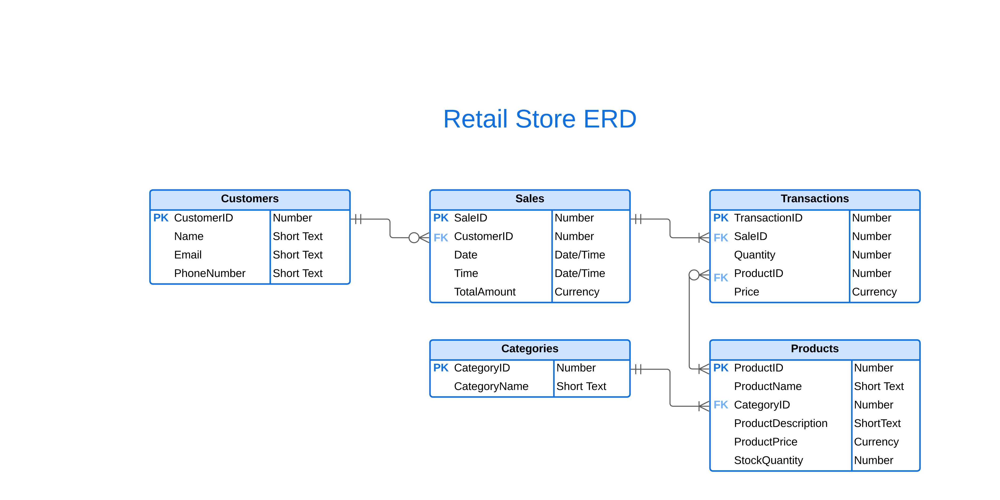
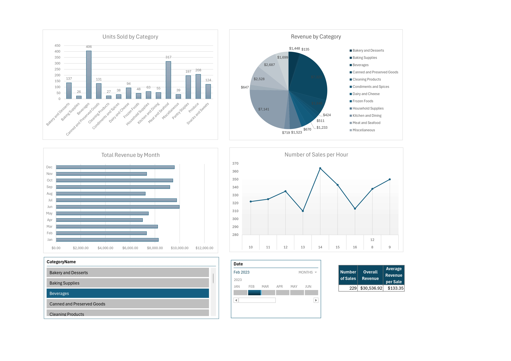

# Retail-Store-Project
This project involves the creation, modeling, analysis and visualization of data from a retail store.

The purpose of this project was to put into practice the skills learned in the BCIT Business Systems course. 

The project consisted of creating fictitious data from a retail store in Access divided between 5 tables: Categories, Customers, Products, Sales and Transactions.

Initially, the main tables were Customers, Products, and Categories. Each one of them has a primary key related to its name (CustomerID, ProductID and CategoryID). 

To build the Sales table, it was necessary to think about the kind of purchases each customer would make. For example, in one sale, a customer may buy more than one product, but it would be messy if I recorded more than one product in just one sale with a single primary key. That’s why I chose to build a joining entity, which is the Transactions table, which made it possible for me to record multiple purchases under a single Sale. 

In the relationship diagram, both tables are connected by the SaleID Primary Key, and the Transactions table is connected to the Products by a secondary key, ProductID. 

Finally, all data was analyzed in Excel to create an interactive dashboard.

